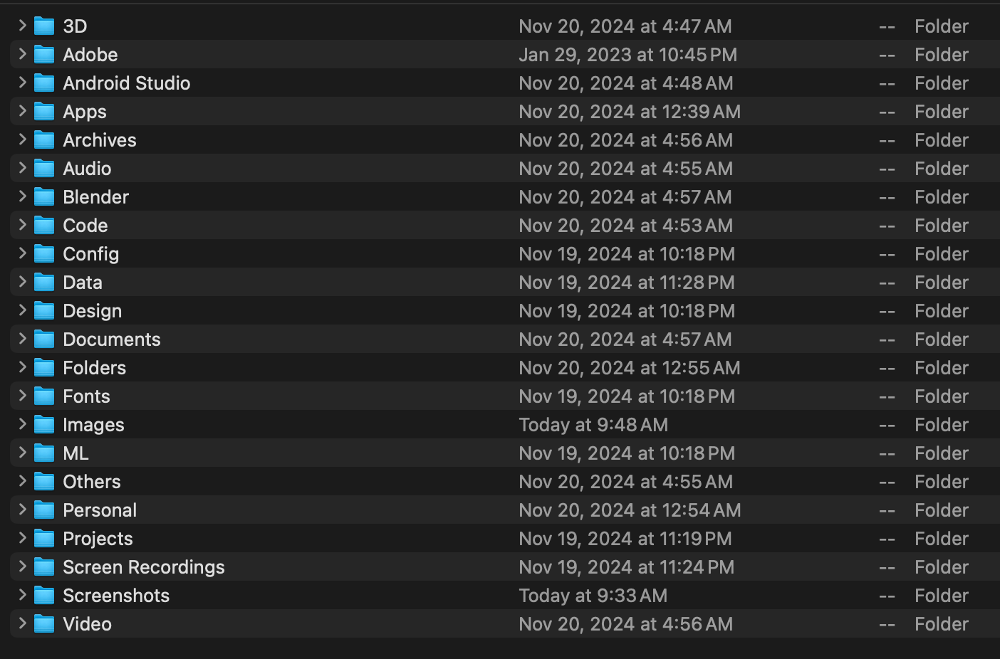

# Clutter - Smart File Organization Tool 🗂️

A modern desktop application for effortlessly organizing files using drag-and-drop. Clutter automatically categorizes and sorts your files based on type, while maintaining a clean and minimal interface.


## Features

- 🖱️ Simple drag-and-drop interface
- 📁 Automatic file categorization by type
- 📊 File extension analysis
- 📈 Folder size analysis 
- ⚙️ Customizable organization rules
- 🔄 Duplicate file handling
- 📝 Modern dark theme interface

## Default Organization Structure



Clutter organizes your files into these categories:

- **3D**: .obj, .fbx, .blend, .stl, .gltf, .usdz files
- **Apps**: .app, .dmg, .vst3 applications
- **Audio**: .mp3, .wav, .flac, .m4a music and audio files
- **Code**: .py, .js, .html, .css, .java source code files
- **Config**: .ini, .cfg, .yaml configuration files
- **Documents**: .pdf, .doc, .txt, .csv text documents
- **Images**: .jpg, .png, .gif, .psd image files
- **Screenshots**: Automatically detected screenshot files
- **Video**: .mp4, .mov, .avi video files
- **Others**: Any unrecognized file types

## Installation

### macOS (M1/M2)

1. Install Python 3.11:
   ```bash
   brew install python@3.11
   ```

2. Setup environment:
   ```bash
   python3.11 -m venv venv
   source venv/bin/activate
   pip install --upgrade pip
   pip install -r requirements.txt
   ```

3. Run:
   ```bash
   python clutter.py
   ```

### Troubleshooting

If you encounter installation issues:
```bash
pip cache purge
pip uninstall tkinterdnd2 -y
ARCHFLAGS="-arch arm64" pip install tkinterdnd2==0.4.0
pip install -r requirements.txt
```

## Known Issues

- Not compatible with Python 3.12 or 3.13
- Requires Python 3.11 for M1/M2 Macs
- Terminal may show IMKClient messages (harmless)